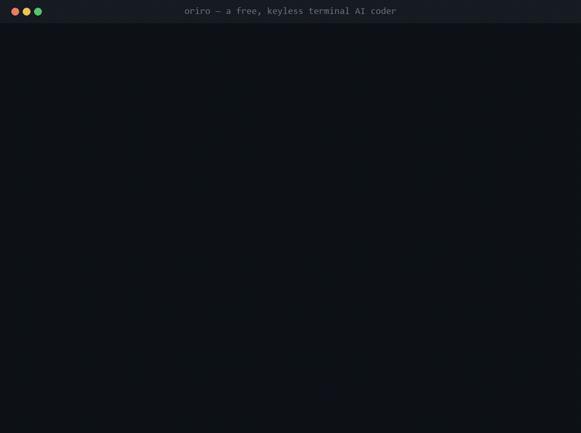

<!-- Banner: added separately by Vinay -->

# ORIRO‑Terminal - **“Head | Memory | Eyeball for AI”**

# **FREE · KEYLESS · BYOK** | **Works in 100 Languages | Deterministic Security Guardian V3**

A free, keyless terminal AI coder — built on the Pi agent harness (used as a library).
It **writes and runs code** from a pool of free routers, works in **your language**, **guards every action**,
can **inspect a live site's structure**, and greets you with an **avatar in its own on-device voice**.
Your language, your machine, no paid keys required.

<p align="center">
  
</p>

<p align="center"><sub>A real terminal session, captured live: <code>npx @oriro/orirocli</code> → write code → Head → Guardian → voice.</sub></p>

## What's inside (this release)
- **Keyless free-router Mux** — best-router selection + invisible failover across free providers, with an on-device floor. **Never a paid key.** BYOK optional (live-validated).
- **100 languages** — pick yours at first run; the model works in English. On-device NLLB translation is an optional add-on (without it, your text passes through as-is).
- **Guardian V3 (Lite)** — a **deterministic** security gate on every tool call (default-on, fail-closed): blocks `curl|sh` remote-exec, destructive wipes, reverse shells, and env/secret exfil. No weights, no tokenizer, no download.
- **Head** — fetches a live site, detects its **sections/structure**, and reports the gaps to build from (the coder writes the code from that report).
- **Scriber (memory)** — a consent-gated local work journal, **off by default**; turns are recalled across sessions and never leave your machine.
- **323 skills** (CORE/TAIL tiered) + **multi-agent orchestration** on the free pool.
- **MCP connector catalog** (59) and **Channels** — run ORIRO from Telegram/Discord/WhatsApp with **your own** bot.
- **Avatar** — pick a face at onboarding; it greets you aloud in its paired on-device voice.

## On the roadmap (not in this release)
Full-page **screenshot → code** Head (Playwright), the **two-way voice loop** (speak + listen/STT), in-REPL **permission modes**, and **`oriro mcp`** guided setup. Today the Head is fetch/structure-based and voice is the avatar's spoken greeting.

**## Install**

**Run it instantly — no install**, works on any OS with Node ≥ 20:
```bash
npx @oriro/orirocli
```

**Or install the** `oriro` command globally:
```bash
npm i -g @oriro/orirocli   # then: oriro
```

**Both paths reach the same first-run setup.** `npx` and `npm i -g` are the supported install channels — they work on every OS with Node ≥ 20, no build step.

<details>
<summary>From source (contributors)</summary>

```bash
git clone https://github.com/oriro-ai/cli && cd cli
npm install && npm run build   # then: node dist/cli.js
```
</details>

> Built on [Pi](https://github.com/earendil-works/pi) (MIT). See `ATTRIBUTION.md` for full provenance.

**ORIRO-Head:**

Always in context; never forgets anything; scribes everything for you locally and present the router “REAL-TIME FOREVER”. 
Goes to the URL → crawls it in a real browser (Playwright).
Captures → full-page screenshot + the rendered HTML (page.content () the post-JS DOM, "what it saw").
Reverse-engineers → feeds that HTML (+ the screenshot for visual context) to the coder model → clean, working code.
Returns BOTH → {html: <what it saw>, screenshot, code: <clean reproduction>}.

**Multi-Lingual** (99 Global Languages): 
You can use your native language in terminal and it will explain in the default language to AI router in your terminal to build and work along with/for you in ORIRO-Terminal. 
TWO-WAY VOICE LOOP LIVE.  (TTS) and hears (STT, with the free translate → English path for the coder).

**Guardian V3** Security: Talk-to-setup MCP (Guardian companion)
By TranzGuard.com, Financial Industry grade Live agentic threat analysis anomalous MCP payloads, crawler/Trojan/spam/3rd-party injection, behavioral detection.   
Guardian V3 Lite is pure deterministic TypeScript regex injection patterns + IOC signatures + hidden- unicode ranges + heuristics. No weights, no tokenizer, no download. It's default-on by construction and it’s a Guardian, as deterministic detectors, not a downloadable model. Speed: Agentic, Deep.

ORIRO MCP setup — guided Q&A, no JSON: it asks name, command/URL, args, env; builds the config for you.
Guardian vets every server before it's saved (proven 5/5): blocks a malicious launch (curl | sh, obfuscated loader, env →URL exfil), asks-to-trust a new clean server, allows an already-trusted one — and remembers your "trust" so it won't re-ask.
Type-check clean.
As forward integration to base CLI Terminal of pi-mono foundation; we used same foundation and carry forwarded instead of backward efforts to build it backward bottom up. Thanks to the foundation work by pi-mono foundation, @Claude @KIMI and all other contributors. 

We also added a fun factor in work for you: AVATAR you chose of your own in Terminal.
A genuinely cool stack, a terminal coder that sees the web (ORIRO-Head: Crawl → Screenshot + HTML → Reverse-engineered code), Speaks/listens in 99 languages, guards itself (Guardian V3 Lite), and can wear a floating avatar that talks back in its own voice. All on-device.

Permission cycle / Safety │ ✅ 4 modes: Shift+Tab → │ Postures │ Manual / Accept_Edits / Auto / Plan / Thinking-cycle → alt+shift+t

**Safety - ORIRO floor baked in: Even Auto can't run what Guardian blocks (wipes/exfil/curl|sh)**

**"Auto"** = don't-ask-for-low-risk, never run-anything; **Plan**= read-only

**“Indicators”** **●** Manual · **✎** Accept Edits · **⏵⏵**Auto · **▢** Plan │ Type-check clean


 License - **MIT License**

Copyright (c) 2026 VINAY SHARMA

Permission is hereby granted, free of charge, to any person obtaining a copy of this software and associated documentation files (the "Software"), to deal in the Software without restriction, including without limitation the rights to use, copy, modify, merge, publish, distribute, sublicense, and/or sell copies of the Software, and to permit persons to whom the Software is furnished to do so, subject to the following conditions: The above copyright notice and this permission notice shall be included in all copies or substantial portions of the Software.

THE SOFTWARE IS PROVIDED "AS IS", WITHOUT WARRANTY OF ANY KIND, EXPRESS OR IMPLIED, INCLUDING BUT NOT LIMITED TO THE WARRANTIES OF MERCHANTABILITY, FITNESS FOR A PARTICULAR PURPOSE AND NONINFRINGEMENT. IN NO EVENT SHALL THE AUTHORS OR COPYRIGHT HOLDERS BE LIABLE FOR ANY CLAIM, DAMAGES OR OTHER LIABILITY, WHETHER IN AN ACTION OF CONTRACT, TORT OR OTHERWISE, ARISING FROM, OUT OF OR IN CONNECTION WITH THE SOFTWARE OR THE USE OR OTHER DEALINGS IN THE SOFTWARE.


